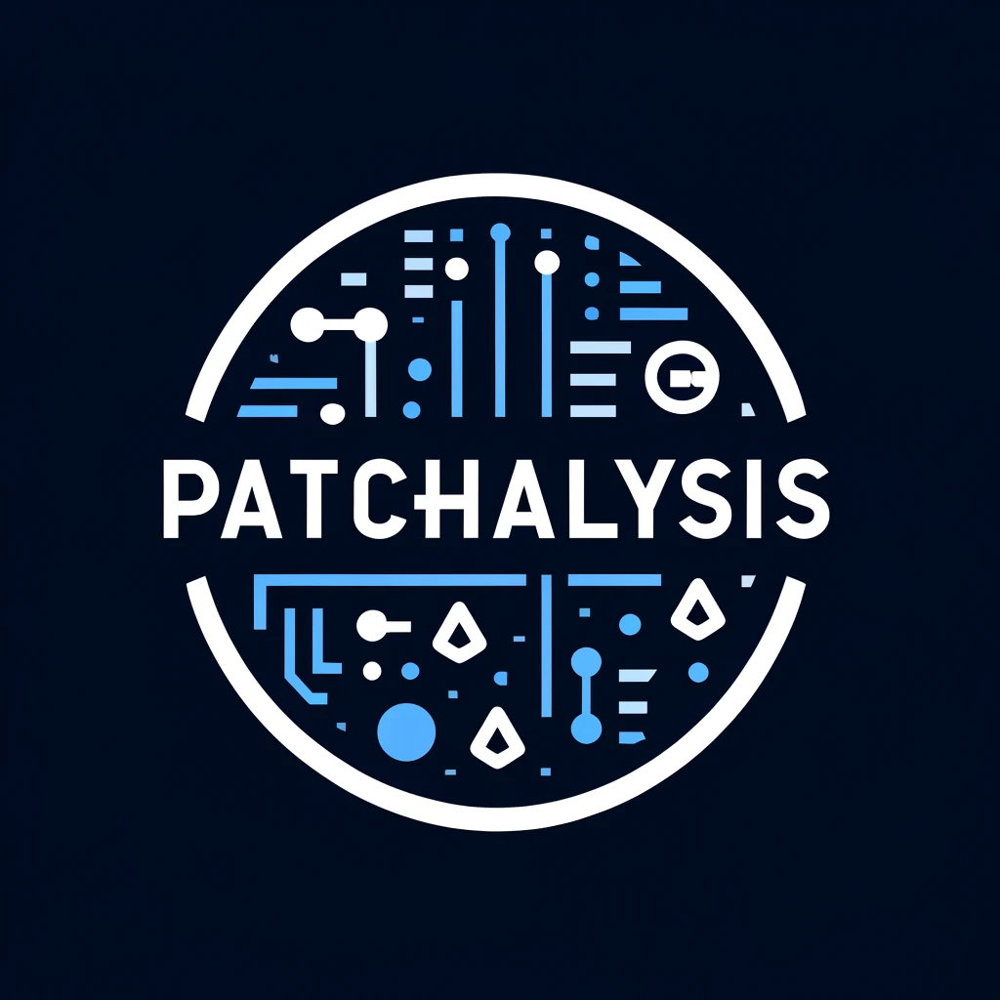
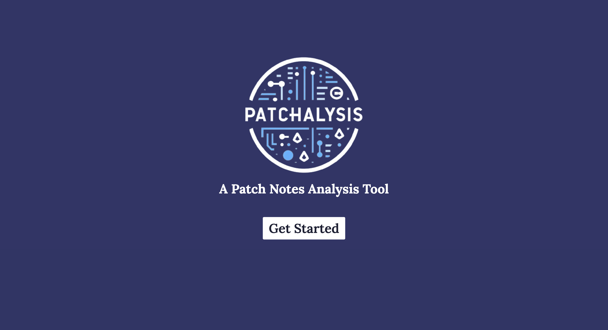
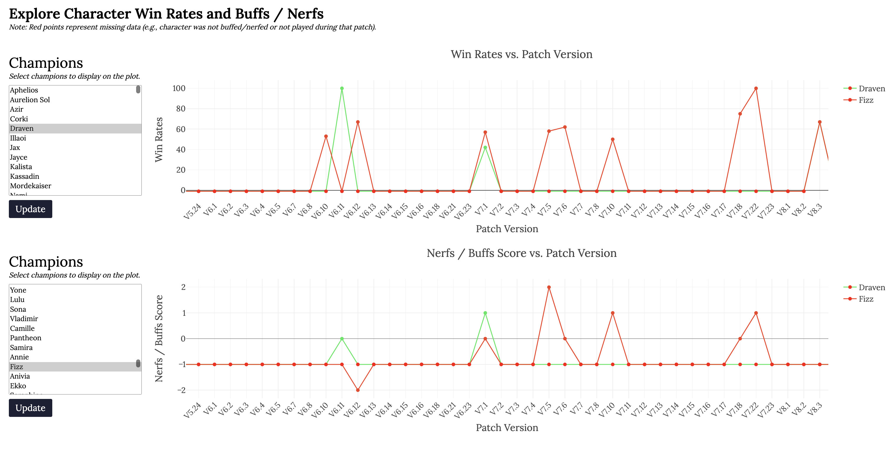
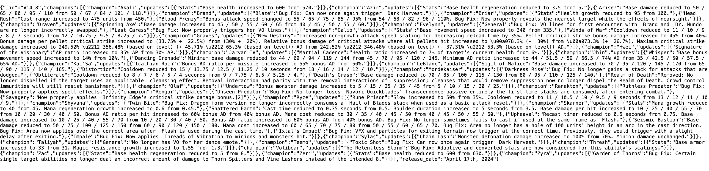

<!-- Improved compatibility of back to top link: See: https://github.com/othneildrew/Best-README-Template/pull/73 -->
<a name="readme-top"></a>
<!--
*** Thanks for checking out Patchalysis. If you have a suggestion
*** that would make this better, please fork the repo and create a pull request
*** or simply open an issue with the tag "enhancement".
*** Don't forget to give the project a star!
*** Thanks again! Now go create something AMAZING! :D
-->


<!-- PROJECT LOGO -->
<br />
<div align="center">
  <a href="https://github.com/SamJSui/Patchalysis">
    
  </a>

<h3 align="center">Patchalysis <a href="https://patchalysis.com">(https://patchalysis.com)</a></h3>

  <p align="left">
    Patchalysis is a data engineering project focused on harnessing historical League of Legends patch notes to predict the landscape of the game. By analyzing trends between updates and champion performance, this tool aids players and developers in understanding the evolving dynamics of the game.
  <br />
  <br />
  </p>
</div>

<div align="center">
  <a href="https://patchalysis.com">
        
  </a>
</div>

<!-- TABLE OF CONTENTS -->
<details>
  <summary>Table of Contents</summary>
  <ol>
    <li>
      <a href="#about-the-project">About The Project</a>
      <ul>
        <li><a href="#built-with">Built With</a></li>
      </ul>
    </li>
    <li>
      <a href="#getting-started">Getting Started</a>
      <ul>
        <li><a href="#prerequisites">Prerequisites</a></li>
        <li><a href="#installation">Installation</a></li>
      </ul>
    </li>
    <li><a href="#roadmap">Roadmap</a></li>
    <li><a href="#contact">Contact</a></li>
    <li><a href="#acknowledgments">Acknowledgments</a></li>
  </ol>
</details>

<!-- ABOUT THE PROJECT -->
## About The Project

* **Interactive Dashboards**: Features a user-friendly interface with dashboards showcasing analytical insights.
* **In-depth Analysis**: Utilizes a sophisticated data pipeline to process and analyze patch notes.
* **Advanced Topic Modeling**: Leverages natural language processing to model keywords and topics in the form of unsupervised learning.

<p align="right">(<a href="#readme-top">back to top</a>)</p>

<div align="center">
  <a href="https://patchalysis.com">
        
  </a>
</div>

* **Seamless data pipeline and deployment**: Efficiently scrapes, processes, and stores data with a continuous workflow, deployed onto AWS Elastic Beanstalk.
* **Integrated API Endpoints**: Hosts RESTful API Endpoints for database access (MongoDB) and retrieval of text and statistical data for each patch.

<div align="center">
  <a href="https://patchalysis.com">
        
  </a>
</div>

### Built With

* [![Python][Python-badge]][Python-url]
* [![Pandas][Pandas-badge]][Pandas-url]
* [![Flask][Flask-badge]][Flask-url]
* [![BeautifulSoup][BeautifulSoup-badge]][BeautifulSoup-url]
* [![MongoDB][MongoDB-badge]][MongoDB-url]

<p align="right">(<a href="#readme-top">back to top</a>)</p>

<!-- GETTING STARTED -->
## Getting Started

### Prerequisites

This project requires Python and several data analysis libraries, listed in `requirements.txt`.

### Installation

1. Clone the repo
   ```sh
   git clone https://github.com/your-username/Patchalysis.git
   cd Patchalysis/
   ```
2. Install Python packages. To view the required dependencies, please reference `requirements.txt`.
   ```sh
   pip install -r requirements.txt
   ```
3. Run the Flask server
   ```sh
   python3 wsgi.py
   ```
4. Open your browser and navigate to the output address.
   ```sh
   http://127.0.0.1:80 (Example)
   ```

### Use

* To use the web components, run the Flask server and navigate to the app in your browser, as described in the Installation section.

* To use the data processing notebooks (located in the `notebooks` directory), ensure you have installed the appropriate dependencies, included in the `requirements.txt` file. Then, open Jupyter Notebook, navigate to your desired .ipynb file, and run through it.

### Files

* The web scraping code can be found in `application/services/beautiful_soup_service.py`.
* The MongoDB code (i.e., databasing) can be found in `application/services/mongo_service.py`.
* The web interface's HTML code can be found in the `application/templates` directory.
* The web interface's CSS/JS code and assets can be found in the `application/static` directory.
* The data processing Jupyter Notebooks can be found in the `notebooks` directory.
* The `scripts` directory includes scripts used to generate some of the project's poster diagrams.

<p align="right">(<a href="#readme-top">back to top</a>)</p>

<!-- ROADMAP -->
## Roadmap

- [x] Scraping and Processing Pipeline
- [x] Analytical Model Development
- [x] Dashboard Implementation
- [x] Release Beta Version
- [ ] Collect User Feedback

<p align="right">(<a href="#readme-top">back to top</a>)</p>


<!-- CONTACT -->
## Contributors

Sam Sui - [@samjsui](https://github.com/samjsui)<br />
Jovi Yoshioka - [@jovanyoshioka](https://github.com/jovanyoshioka)

Project Link: [https://github.com/SamJSui/Patchalysis](https://github.com/SamJSui/Patchalysis)

<p align="right">(<a href="#readme-top">back to top</a>)</p>


<!-- ACKNOWLEDGMENTS -->
## Acknowledgments

This project was a part of the COSC 426: Introduction to Data Mining & Analytics course taught at the University of Tennessee Knoxville. The course is taught by Dr. Michela Taufer, accompanied by teaching assistants Ian Lumsden, Nigel Tan, Paula Olaya, Jack Marquez, and Syed Meerza.

Icons provided by Font Awesome, License: https://fontawesome.com/license

Icons and images credited to:
  - [Scraper icons created by Freepik - Flaticon](https://www.flaticon.com/free-icons/scraper)
  - [Publish icons created by Prashanth Rapolu 15 - Flaticon](https://www.flaticon.com/free-icons/publish)
  - [Magnifying glass icons created by Payungkead - Flaticon](https://www.flaticon.com/free-icons/magnifying-glass)
  - [Cluster icons created by Freepik - Flaticon](https://www.flaticon.com/free-icons/cluster)
  - [Onboarding icons created by Smashicons - Flaticon](https://www.flaticon.com/free-icons/onboarding)

<p align="right">(<a href="#readme-top">back to top</a>)</p>

<!-- MARKDOWN LINKS & IMAGES -->
[Python-badge]: https://img.shields.io/badge/Python-3776AB?style=for-the-badge&logo=python&logoColor=white
[Python-url]: https://python.org/
[Pandas-badge]: https://img.shields.io/badge/Pandas-150458?style=for-the-badge&logo=pandas&logoColor=white
[Pandas-url]: https://pandas.pydata.org/
[Flask-badge]: https://img.shields.io/badge/Flask-000000?style=for-the-badge&logo=flask&logoColor=white
[Flask-url]: https://flask.palletsprojects.com/
[BeautifulSoup-badge]: https://img.shields.io/badge/BeautifulSoup-3776AB?style=for-the-badge&logo=python&logoColor=white
[BeautifulSoup-url]: https://www.crummy.com/software/BeautifulSoup/
[MongoDB-badge]: https://img.shields.io/badge/MongoDB-47A248?style=for-the-badge&logo=mongodb&logoColor=white
[MongoDB-url]: https://www.mongodb.com/
